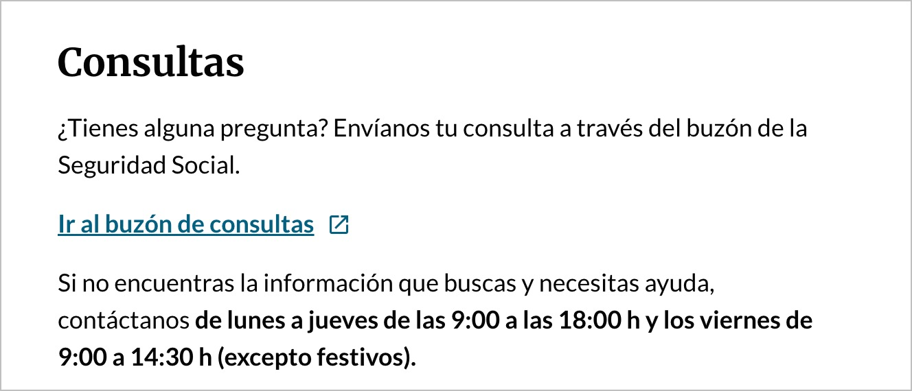
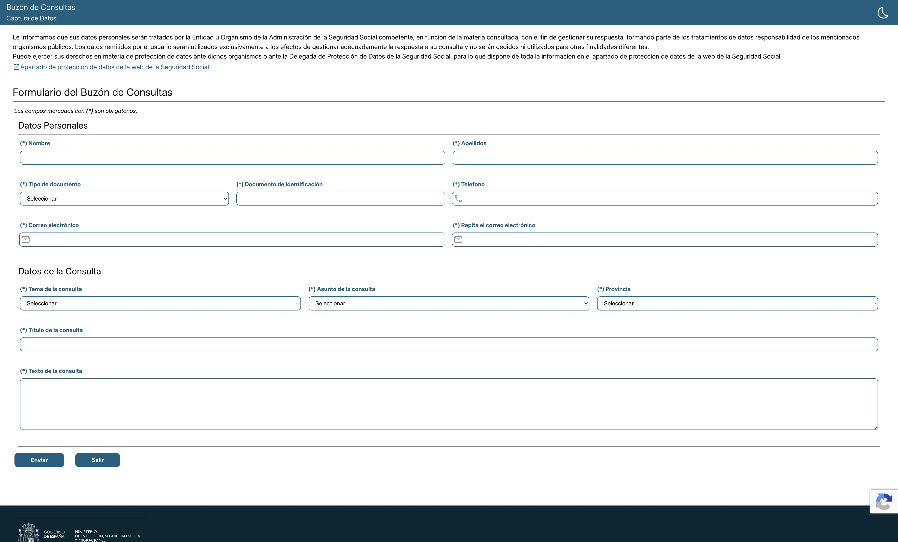
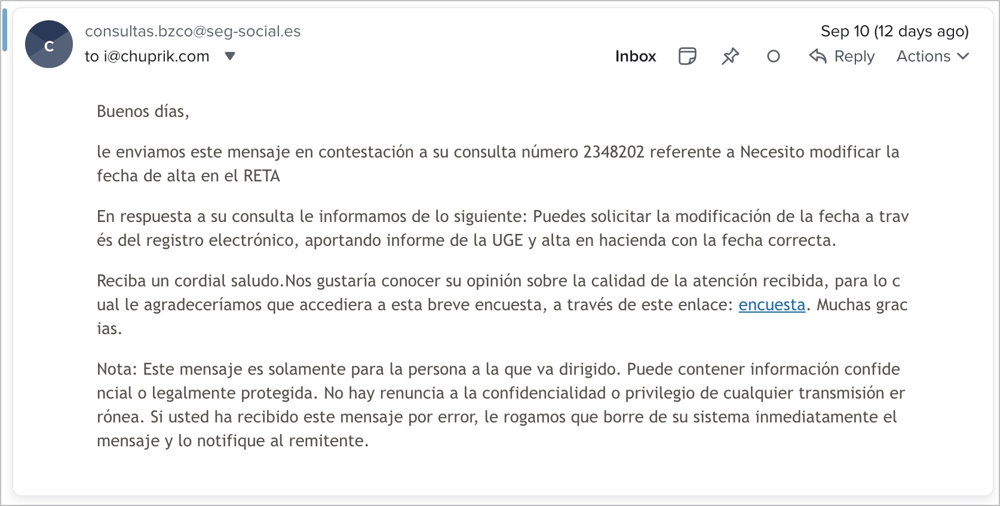
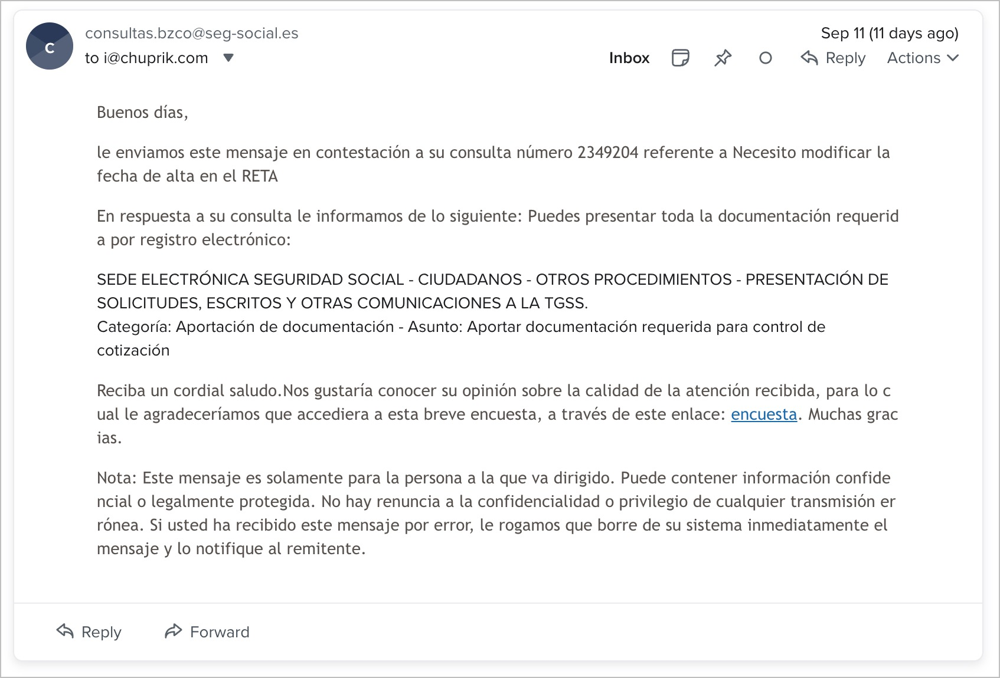
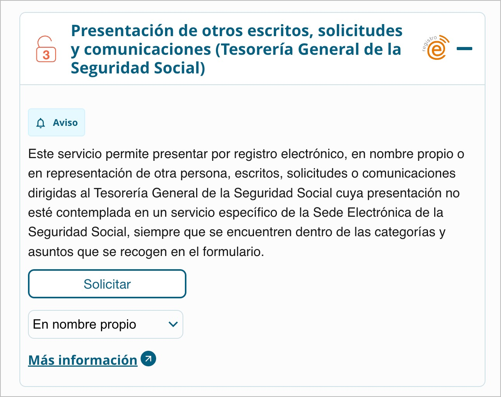
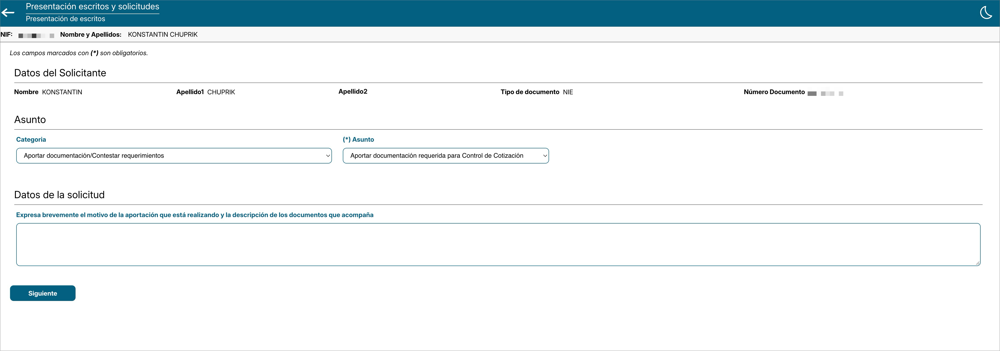
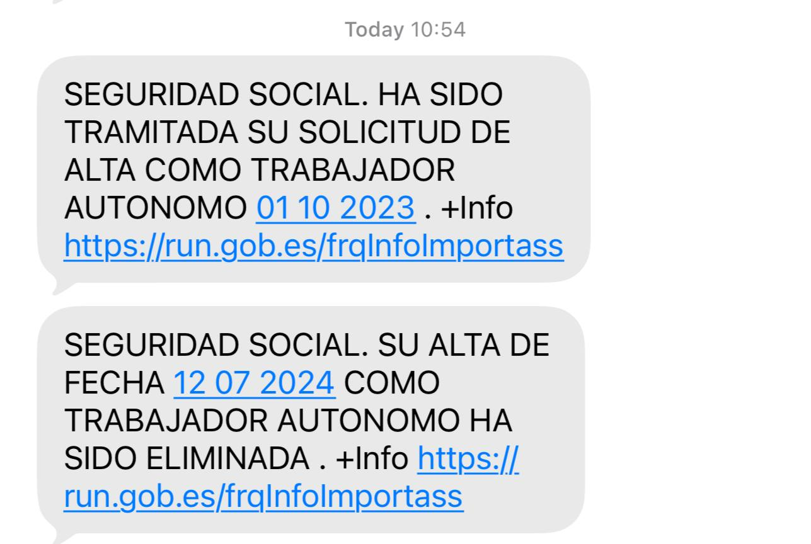

# Смена даты регистрации в RETA

Сначала [меняем дату регистрации autónomo в налоговой](change-tax-registration-date.md).

Гайд актуален на сентябрь 2026 года. TGSS любит обновлять сайт. Раньше был отдельный пункт для связи, но теперь его убрали.

Чтобы узнать, как запросить изменение даты регистрации в RETA, я воспользовался обратной связью на [странице контактов Importass](https://portal.seg-social.gob.es/wps/portal/importass/importass/contacto).

Нужная ссылка — **«Ir al buzón de consultas»**.

Если что-то в гайде потеряло актуальность, то восопльзуйтесь обратной связью.

Мне ответили, что для смены даты регистрации в RETA необходимо отправить всего два документа — налоговый сертификат и письмо от UGE.

Саму форму отправки документов спрятали. Пришлось уточнять отдельно, как её найти.

Она доступна в [разделе «Otros procedimientos»](https://sede.seg-social.gob.es/wps/portal/sede/sede/Ciudadanos/otros+procedimientos/12otros+procedimientos).

Нужная процедура — в конце списка.

Заполняем форму и ждём. На странице после отправки документов можно скачать Justificante. Если сроки для изменения даты в RETA поджимают, то можно отправить Justificante, что мяч на стороне TGSS.

На четвёртый рабочий день я увидел в личном кабинете изменённую дату регистрации. В тот же день пришло письмо на почту, что процедура завершена, а PDF с официальным ответом TGSS доступен по ссылке из письма.

Ещё через день прислали милое SMS.

Сумму, которую требуется доплатить, TGSS рассчитает самостоятельно. У меня уведомление в ЛК появилось спустя несколько дней, на почту ничего не приходило.
