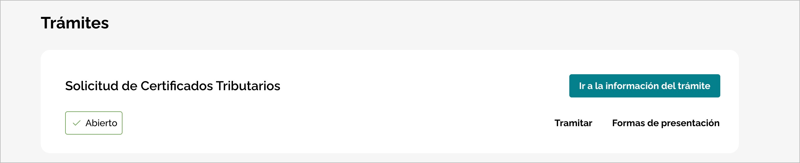
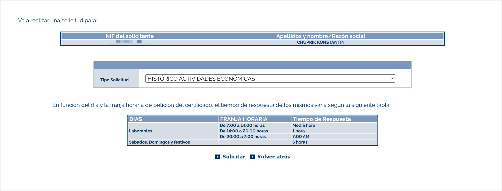
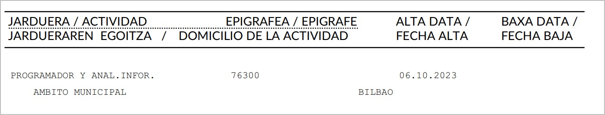

# Смена даты регистрации в налоговой

Для изменения даты регистрации в RETA сначала потребовалось изменить дату начала деятельности autónomo в налоговой.

> Гайд основан на личном опыте в Бискае (Bizkaia). Указанные сервисы и контакты относятся к местной налоговой; в других регионах порядок действий может отличаться.

Всего есть два варианта изменения даты начала деятельности (*fecha de alta*):

- подать **modelo 036** с исправленной датой;
- обратиться лично в офис налоговой.

Попытка подготовить modelo 036 через BILA (Бискайская тема) у меня закончилась ошибкой связанной с адресом деятельности, поэтому идём ногами в налоговую.

### 1. Записаться на приём

Без ситы никто не примет, ситу брать по телефону [946 083 000](tel:+34946083000).

### 2. Подготовить документы

На приём я взял:

- **Заявление в свободной форме.** Заранее подготовил текст, что я хочу сделать (спасибо chatgpt) и распечатал. В тексте описал, что мне требуется изменить дату регистрации, так как это требует UGE и указал какая дата мне нужна. На месте попросили подписать бумагу.
- **Распечатанное требование UGE** об изменении даты регистрации.
- **TIE.**

### 3. Принести доки в налоговую

Вопросов ко мне никаких не было, сотрудник отсканировал все документы и предупредил, что если изменение одобрят, новая дата появится в системе не сразу.

## 4. Запросить налоговый сертификат

В конце того же дня я запросил сертификат, чтобы проверить, обновилась ли дата начала деятельности.

Откройте [страницу запроса налоговых сертификатов на eBizkaia](https://appstac.ebizkaia.eus/es/ficha-procedimiento?procedimiento=1788). Нужная процедура называется **Solicitud de Certificados Tributarios**.

В форме запроса в поле **Tipo Solicitud** выберите **HISTÓRICO ACTIVIDADES ECONÓMICAS** — историю экономической деятельности.

## 5. Получить сертификат и проверить дату

Ответы подписываются вручную, нотифай пришёл с утра в [раздел уведомлений «Mis notificaciones» на eBizkaia](https://ataria.ebizkaia.eus/es/mis-notificaciones).

В полученном сертификате я проверил поле **FECHA ALTA**: в нём уже стояла запрошенная дата начала деятельности.

После подтверждения новой даты в налоговой следующий шаг — [смена даты регистрации в RETA](change-reta-registration-date.md).

А еще требуется подать декларации по доходам за период начиная с новой даты начала деятельности, но это уже другая история.
